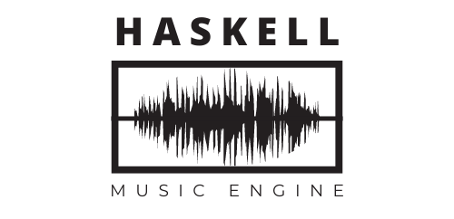

# Haskell music engine



This is a project using `codeworld-api` package, ready to be used with either Cabal or Stack. The project also contains `hspec` (with automatic discovery of specification files) and `doctest` test suites.

The project can be used to either visualise text notation with sheet music and convert it into MIDI file. 

## Prerequisites

This project can be build with Cabal and GHC 8.10.7 or with Stack tool.
We recommend that you use [ghcup](https://www.haskell.org/ghcup/) to install these.

There is IDE support for Cabal and Haskell through Haskell Language Server, in particular, there seems to be strong support for Haskell development in Visual Studio Code.
However, you can also use Vim or Emacs with separate REPL (e.g. via `cabal v2-repl`) and [`ghcid`](https://github.com/ndmitchell/ghcid#readme).

## How to use


Write your composition in an array format into myComposition, where each element is a symbol in format ither (Rest duration) for rests, either (Note octave pitch duration) for notes.

- Octave - the number of the octave where the note is placed, Int in range of (0..9). 5th octave is considered as main.

- Pitch - Heigth of note, using standart format of note names. One of the following: C, Cs, D, Ds, E, F, Fs, G, Gs, A, As, B.

- Duration - how long the note/rest will last. One of the following, in descending order: Whole, Half, Quarter, Eigth, Sixteen.

To convert your notation into midi, put convertToMidi into run function. To write it with sheet music, put visualize there.


### Using Cabal

To build and run a project (without tests), use

```sh
cabal v2-run --disable-tests
```

from the project directory. This will download all the necessary dependencies, compile the project and start `CodeWorld canvas server` at http://localhost:3000

To simply build the project, run

```sh
cabal v2-build
```


#### Freezing dependencies

When you add/change dependencies of the project it is a good idea to freeze the used versions, to ensure the project will be successfully built on another machine at another time. To freeze dependencies, run

```sh
cabal v2-freeze
```
